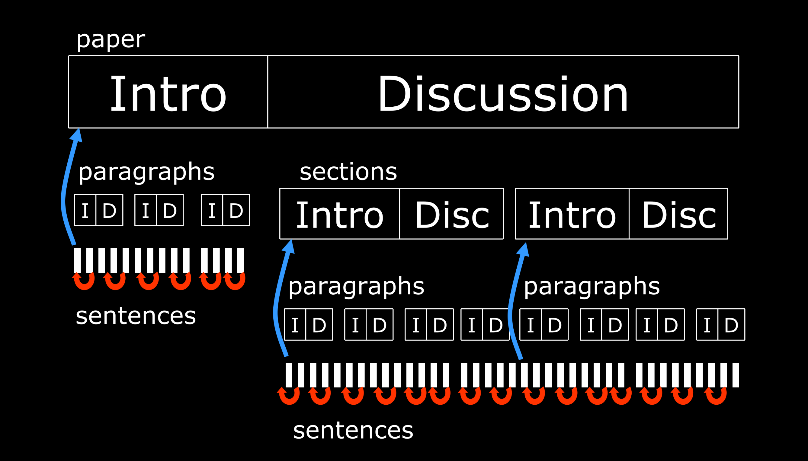
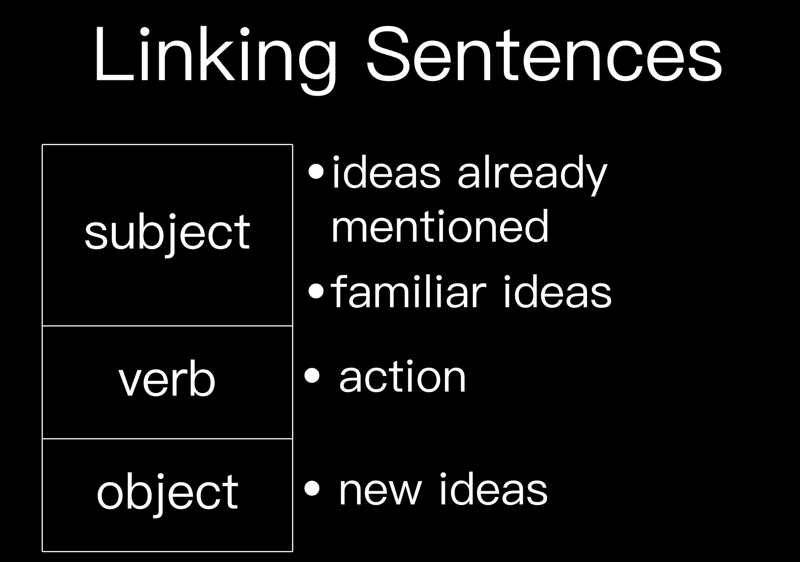
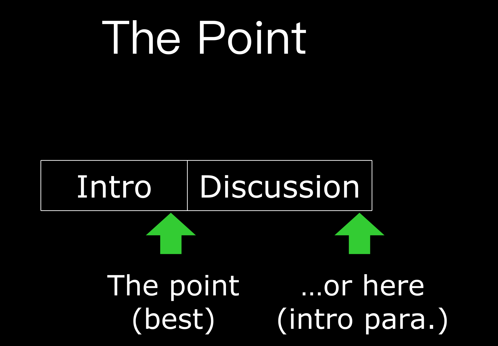
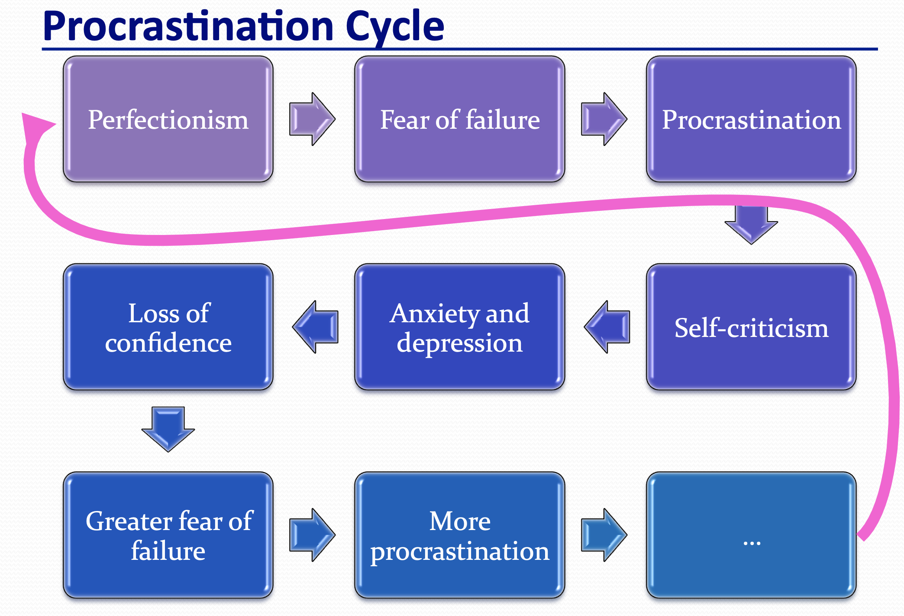

# How_To_Do_Good_Research

<a href="http://www.thecomputationalphotographer.com/wp-content/uploads/2017/03/fredo_do_good_research_2016.pdf">fantastic slides</a>

## 1. **3 qualities of successful Ph.D. students** 

*There's a ruinous misconception that a Ph.D. must be smart.This can't be true. A smart person would know better than to get a Ph.D.”* 

* Perseverance
* tenacity 
* cogency 

hmmm, interesting blog <a href="http://matt.might.net/articles/">Matt Might </a>

## 2. Elements of a successful graduate career 

<a href="http://people.csail.mit.edu/billf/talks/10minFreeman2013.pdf">slides</a>

Bill Freeman sent this e-mail to the MIT Computer Science faculty and other CSAIL researchers: 

"  Could each of you please send me what you think is the most important quality for success in graduate school?"

1. curiosity
2. passion
3. Purposefulness
4. fearless
5. flexibility
6. You want to be a marathon runner, not a sprinter. 

#### A very intersting story by Charles Leiserson[author of CLRS]

> Bill,
>  I'll tell you a joke instead. 
>
> A rabbit is caught by a wolf. The wolf is about to eat the rabbit, but the rabbit protests, "I'm only a few weeks away from defending my Ph.D. dissertation. I have worked so hard, and everyone tells me I have so much promise. It would be a shame to kill me when I have such a bright future of research contributions ahead of me that will benefit the world." The wolf says, "You're writing a Ph.D. dissertation? What is it on?" The rabbit replies, "It's entitled, *The Superiority of Rabbits over Foxes and Wolves.*" The wolf says, "That's about the stupidest thing you could have said. I'll eat you right now." The rabbit says, "Wait, wait! Come to my den and read my thesis draft. If you don't agree with my conclusions, I will willingly give myself up to you." So, the wolf goes off with the rabbit to the rabbit's den ... and the wolf never comes out. 
>
> A few weeks later, the rabbit is caught by a fox. The fox is about to eat the rabbit, but the rabbit protests, "I'm only a few days away from defending my Ph.D. dissertation. I have worked so hard, and everyone tells me I have so much promise. It would be a shame to kill me when I have such a bright future of research contributions ahead of me that will benefit the world." The fox says, "You're writing a Ph.D. dissertation? What is it on?" The rabbit replies, "It's entitled, *The Superiority of Rabbits over Foxes and Wolves.*" The fox says, "That's about the stupidest thing you could have said. I'll eat you right now." The rabbit says, "Wait, wait! Come to my den and read my thesis draft. If you don't agree with my conclusions, I will willingly give myself up to you." So, the fox goes off with the rabbit to the rabbit's den ... and the fox never comes out. 
>
> A few weeks later, the rabbit is out and meets up with his old friend the muskrat. The muskrat says, "I hear you finally earned your Ph.D. Congratulations!" The rabbit says, "Yes, I just defended my Ph.D. thesis a few days ago." The muskrat asks, "What was your thesis topic?" The rabbit answers, *The Superiority of Rabbits over Foxes and Wolves.*" The muskrat says, "That's quite interesting. Can I read it?" The rabbit says, "Sure. Come to my den." They enter the den, and the muskrat sees the bones of foxes and wolves all over the floor. In the corner is a large lion. 
>
> Which brings us to the moral of the story: *More important than your thesis topic is who your advisor is.* 

## 2. The science of scientific writing

<a href="https://cseweb.ucsd.edu/~swanson/papers/science-of-writing.pdf">article</a>

1. Follow a grammatical <u>subject</u> as soon as possible with its <u>verb</u>.
2. Place in the stress position the “new information” you want the reader to emphasize[often the end of a sentence]. 
3. Place the person or thing whose “story” a sentence is telling at the beginning of the sentence, in the topic position.

 4. Place appropriate “<u>old information</u>” (material already stated in the discourse) in the topic position for linkage backward and contextualization forward.

5. Articulate the action of every clause or sentence in its verb.

6. In general, provide context for your reader before asking that reader to consider anything new.
7. In general, try to ensure that the relative emphases of the substance coincide with the relative expectations for emphasis raised by the structure. 

 [writing-papers-gad-2010.ppt](writing-papers-gad-2010.ppt)

First sentence (or the point) must include section title

 

## 3. Time management

<a href="http://www.dgp.toronto.edu/~hertzman/courses/gradSkills/2010/TimeManagement.pdf">slides</a>

I'm actually suffering a lot from this procastination cycle. It seems that there are no effective solutions. 

May be could try GTD [getting things done]

<a href="https://www.bilibili.com/video/av73280139?from=search&seid=1659673618579243673">more about GTD click me</a>

